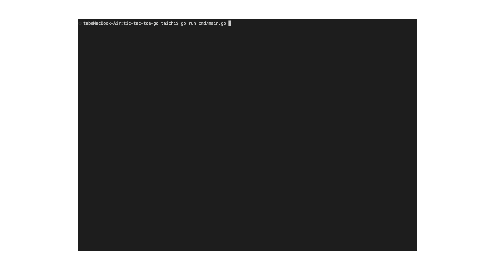

# Tic Tac Toe with Go

三目並べを Go で実装する




##　 🎉 How to Play

通常の三目並べ同様、縦、横、斜めどれか一つを先に揃えた方の勝ち

##　 ⚙️ How to Build

```bash
go build cmd/main.go
```

##　 ❗️ Hoe to Run

```bash
go run cmd/main.go
```
